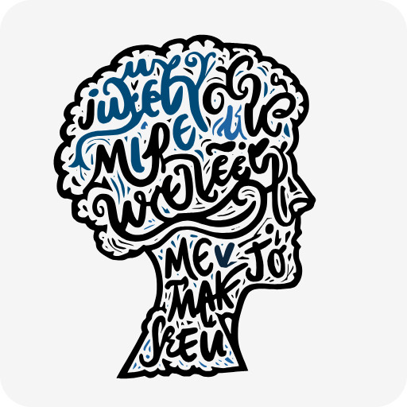
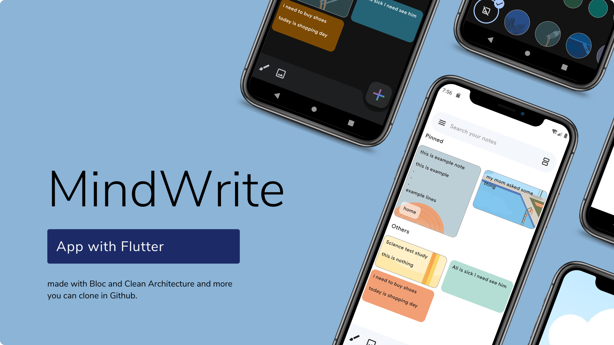

<div align="center">
  
  
  <h1>MindWrite</h1>
  
  
  
</div>

---

**MindWrite** is a best practice app implementing Clean Architecture with the **Bloc** pattern and exploring technologies such as:
`equatable`, `image_picker`, `get_it`, `go_router`, `hive`, and more.

---

## App Demo:

<div align="center">
  
</div>

---

## Dependencies:

```yaml
bloc: ^8.1.4
hive: ^2.2.3
uuid: ^4.5.0
intl: ^0.19.0
get_it: ^7.7.0
equatable: ^2.0.5
go_router: ^14.2.7
share_plus: ^10.0.2
hive_flutter: ^1.1.0
flutter_bloc: ^8.1.6
image_picker: ^1.1.2
flutter_svg: ^2.0.10+1
cupertino_icons: ^1.0.6
flutter_animate: ^4.5.0
loading_animation_widget: ^1.2.1
flutter_staggered_grid_view: ^0.7.0
syncfusion_flutter_signaturepad: ^26.2.14
```

### Available Features :

- [x] draw
- [x] archive
- [x] deleted
- [x] palette colors and background image for notes 
- [x] add and take image to notes
- [x] pin and ordering lists
- [x] label making
- [x] send and share + make copy
- [x] light theme
- [x] settings

### Todo :

- [ ] text to speech
- [ ] reminders
- [ ] date picker
- [ ] persian version
- [ ] recording
- [ ] tick boxes in notes
- [ ] do and redo buttons
- [ ] note loading and drag droping
- [ ] back button invoke poping
- [ ] use model entitiy instead noemodel

